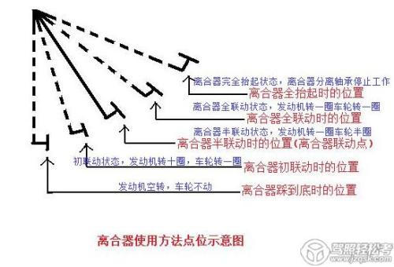

## 离合的作用
> 在引擎启动的情况下控制动力的开启与关闭   
>  - 离合器根据踩下的程度的状态
>  - 离合器在非空挡的时候完全松开会导致熄火状态，
>  - 科目二通常使用半联动状态

## 科目二离合器的关键操作
> 控制车速 
>>    - 离合器**抬起要慢，踩下要快**
>>    - 换挡的时候，**离合器踩到底**
>>    - 行进的时候，**将离合器缓慢抬高到初联动状态** 进行低速行驶 
>>    - 离合器抬的过高会导致速度过快，甚至熄火
> 注意问题
>>    - 行进的时候，将离合器稳定在**低速联动状态**
>>    - 注意离合器抬高后的**速度加快**
>>    - 注意离合器抬的过快导致**熄火**
  